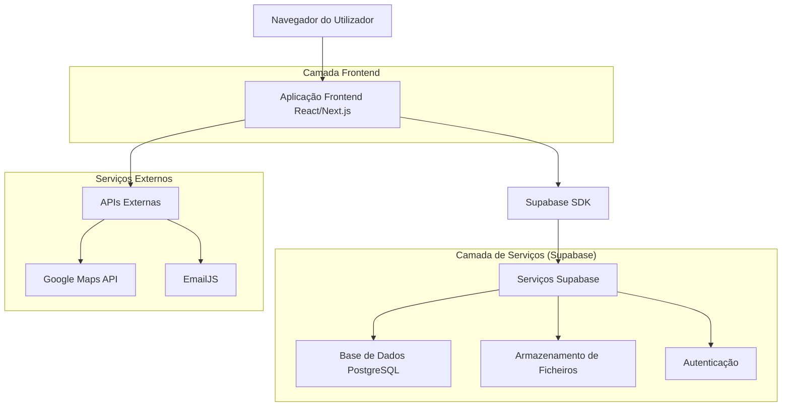
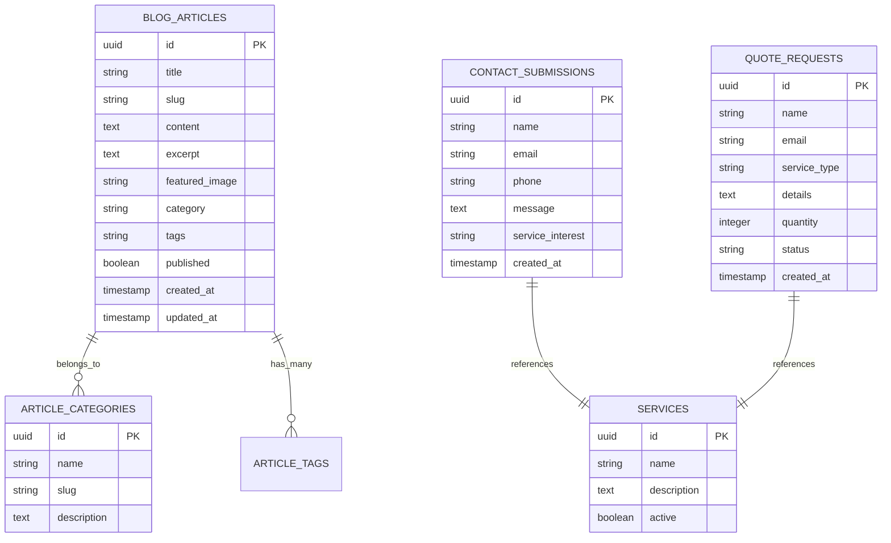

# Documento de Arquitetura Técnica - Quinta Casa do Plátano

## 1. Design da Arquitetura



## 2. Descrição das Tecnologias

- **Frontend**: Next.js@14 + React@18 + TypeScript + Tailwind CSS@3 + Framer Motion
- **Backend**: Supabase (PostgreSQL, Auth, Storage)
- **Deployment**: Vercel
- **SEO**: Next.js built-in SEO, structured data, sitemap
- **Analytics**: Google Analytics 4

## 3. Definições de Rotas

| Rota | Propósito |
|------|----------|
| / | Página inicial com hero section e apresentação da quinta |
| /sobre-nos | Página sobre a história e missão da quinta |
| /ovelhas | Informações sobre a raça Vendéen e galeria |
| /servicos | Lista de serviços oferecidos pela quinta |
| /blog | Listagem de artigos do blog |
| /blog/[slug] | Página individual de artigo do blog |
| /blog/categoria/[categoria] | Artigos filtrados por categoria |
| /contactos | Página de contacto com formulário e localização |
| /sitemap.xml | Sitemap para SEO |
| /robots.txt | Arquivo robots para crawlers |

## 4. Definições de API

### 4.1 APIs Principais

**Gestão de Artigos do Blog**
```
GET /api/blog/articles
```

Resposta:
| Nome do Parâmetro | Tipo | Descrição |
|-------------------|------|----------|
| articles | array | Lista de artigos com título, slug, resumo, data |
| totalCount | number | Total de artigos para paginação |

**Envio de Formulário de Contacto**
```
POST /api/contact
```

Pedido:
| Nome do Parâmetro | Tipo | Obrigatório | Descrição |
|-------------------|------|-------------|----------|
| name | string | true | Nome do contacto |
| email | string | true | Email do contacto |
| phone | string | false | Telefone do contacto |
| message | string | true | Mensagem do contacto |
| service | string | false | Serviço de interesse |

Resposta:
| Nome do Parâmetro | Tipo | Descrição |
|-------------------|------|----------|
| success | boolean | Status do envio |
| message | string | Mensagem de confirmação |

**Pedido de Orçamento**
```
POST /api/quote
```

Pedido:
| Nome do Parâmetro | Tipo | Obrigatório | Descrição |
|-------------------|------|-------------|----------|
| name | string | true | Nome do solicitante |
| email | string | true | Email do solicitante |
| service | string | true | Tipo de serviço solicitado |
| details | string | true | Detalhes específicos do pedido |
| quantity | number | false | Quantidade (se aplicável) |

## 5. Modelo de Dados

### 5.1 Definição do Modelo de Dados



### 5.2 Linguagem de Definição de Dados

**Tabela de Artigos do Blog (blog_articles)**
```sql
-- criar tabela
CREATE TABLE blog_articles (
    id UUID PRIMARY KEY DEFAULT gen_random_uuid(),
    title VARCHAR(255) NOT NULL,
    slug VARCHAR(255) UNIQUE NOT NULL,
    content TEXT NOT NULL,
    excerpt TEXT,
    featured_image VARCHAR(500),
    category VARCHAR(100),
    tags TEXT[],
    published BOOLEAN DEFAULT false,
    created_at TIMESTAMP WITH TIME ZONE DEFAULT NOW(),
    updated_at TIMESTAMP WITH TIME ZONE DEFAULT NOW()
);

-- criar índices
CREATE INDEX idx_blog_articles_slug ON blog_articles(slug);
CREATE INDEX idx_blog_articles_published ON blog_articles(published);
CREATE INDEX idx_blog_articles_category ON blog_articles(category);
CREATE INDEX idx_blog_articles_created_at ON blog_articles(created_at DESC);

-- permissões
GRANT SELECT ON blog_articles TO anon;
GRANT ALL PRIVILEGES ON blog_articles TO authenticated;

-- dados iniciais
INSERT INTO blog_articles (title, slug, content, excerpt, category, published) VALUES
('Bem-vindos à Quinta Casa do Plátano', 'bem-vindos-quinta-casa-platano', 'Conteúdo do artigo de boas-vindas...', 'Apresentação da nossa quinta e missão', 'geral', true),
('A Raça Vendéen: Características e Vantagens', 'raca-vendeen-caracteristicas', 'Artigo detalhado sobre a raça Vendéen...', 'Conheça as características únicas da raça Vendéen', 'racas', true);
```

**Tabela de Submissões de Contacto (contact_submissions)**
```sql
-- criar tabela
CREATE TABLE contact_submissions (
    id UUID PRIMARY KEY DEFAULT gen_random_uuid(),
    name VARCHAR(255) NOT NULL,
    email VARCHAR(255) NOT NULL,
    phone VARCHAR(20),
    message TEXT NOT NULL,
    service_interest VARCHAR(100),
    created_at TIMESTAMP WITH TIME ZONE DEFAULT NOW()
);

-- criar índices
CREATE INDEX idx_contact_submissions_created_at ON contact_submissions(created_at DESC);
CREATE INDEX idx_contact_submissions_email ON contact_submissions(email);

-- permissões
GRANT INSERT ON contact_submissions TO anon;
GRANT ALL PRIVILEGES ON contact_submissions TO authenticated;
```

**Tabela de Pedidos de Orçamento (quote_requests)**
```sql
-- criar tabela
CREATE TABLE quote_requests (
    id UUID PRIMARY KEY DEFAULT gen_random_uuid(),
    name VARCHAR(255) NOT NULL,
    email VARCHAR(255) NOT NULL,
    service_type VARCHAR(100) NOT NULL,
    details TEXT NOT NULL,
    quantity INTEGER,
    status VARCHAR(50) DEFAULT 'pending',
    created_at TIMESTAMP WITH TIME ZONE DEFAULT NOW()
);

-- criar índices
CREATE INDEX idx_quote_requests_status ON quote_requests(status);
CREATE INDEX idx_quote_requests_created_at ON quote_requests(created_at DESC);

-- permissões
GRANT INSERT ON quote_requests TO anon;
GRANT ALL PRIVILEGES ON quote_requests TO authenticated;
```

**Tabela de Serviços (services)**
```sql
-- criar tabela
CREATE TABLE services (
    id UUID PRIMARY KEY DEFAULT gen_random_uuid(),
    name VARCHAR(255) NOT NULL,
    description TEXT,
    active BOOLEAN DEFAULT true
);

-- permissões
GRANT SELECT ON services TO anon;
GRANT ALL PRIVILEGES ON services TO authenticated;

-- dados iniciais
INSERT INTO services (name, description) VALUES
('Criação e Reprodução', 'Serviços especializados de criação e reprodução de ovelhas Vendéen'),
('Venda de Animais', 'Venda de ovelhas Vendéen de alta qualidade para criadores'),
('Consultoria Técnica', 'Consultoria especializada em ovinocultura e gestão de rebanhos'),
('Formação', 'Cursos e workshops sobre criação de ovelhas e boas práticas');
```