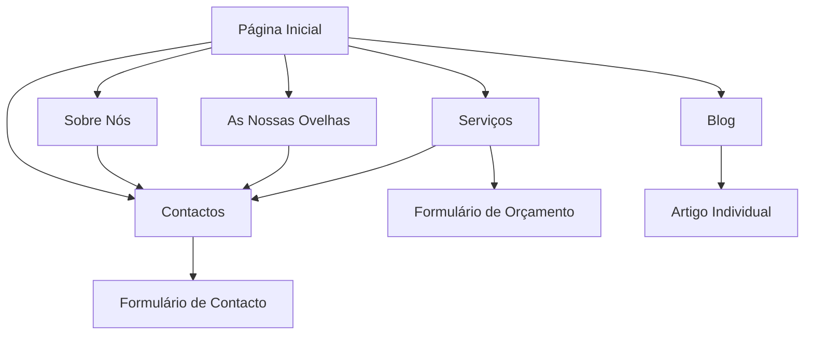

# Documento de Requisitos do Produto - Quinta Casa do Plátano

## 1. Visão Geral do Produto
Website institucional para a Quinta Casa do Plátano, especializada na criação e produção de ovelhas da raça Vendéen em Samora Correia. O site visa apresentar os serviços da quinta, educar sobre a raça Vendéen e estabelecer presença digital profissional para atrair clientes e parceiros.

## 2. Funcionalidades Principais

### 2.1 Módulos de Funcionalidades
O website da Quinta Casa do Plátano consiste nas seguintes páginas principais:
1. **Página Inicial**: secção hero, navegação, apresentação da quinta, serviços em destaque
2. **Sobre Nós**: história da quinta, programa de criação, equipa
3. **As Nossas Ovelhas**: informações sobre a raça Vendéen, galeria de imagens
4. **Serviços**: criação, venda, consultoria, reprodução
5. **Blog**: artigos sobre ovinocultura, notícias da quinta, dicas de criação
6. **Contactos**: formulário de contacto, localização, informações de contacto

### 2.2 Detalhes das Páginas

| Nome da Página | Nome do Módulo | Descrição da Funcionalidade |
|----------------|----------------|------------------------------|
| Página Inicial | Secção Hero | Apresentar imagem impactante da quinta com logo, título e call-to-action principal |
| Página Inicial | Apresentação da Quinta | Resumo da história, missão e valores da quinta em formato visual atrativo |
| Página Inicial | Serviços em Destaque | Cards com os principais serviços oferecidos com links para página de serviços |
| Sobre Nós | História da Quinta | Narrativa completa sobre a fundação e evolução da quinta |
| Sobre Nós | Programa de Criação | Detalhes sobre métodos de criação, cuidados e filosofia de trabalho |
| As Nossas Ovelhas | Informações da Raça | Características, origem e benefícios da raça Vendéen |
| As Nossas Ovelhas | Galeria de Imagens | Galeria responsiva com imagens das ovelhas e instalações |
| Serviços | Lista de Serviços | Descrição detalhada de criação, venda, consultoria e reprodução |
| Serviços | Formulário de Orçamento | Formulário para pedidos de orçamento específicos |
| Blog | Lista de Artigos | Listagem paginada de artigos com categorias e pesquisa |
| Blog | Artigo Individual | Página de artigo com conteúdo completo, partilha social e comentários |
| Blog | Categorias | Organização de conteúdo por temas (criação, saúde, mercado) |
| Contactos | Formulário de Contacto | Formulário com validação para contacto direto |
| Contactos | Mapa de Localização | Mapa interativo mostrando localização em Samora Correia |
| Contactos | Informações de Contacto | Telefone, email e morada claramente apresentados |

## 3. Processo Principal

**Fluxo do Visitante:**
O visitante acede à página inicial onde é apresentado à quinta e aos seus serviços. Pode navegar para conhecer melhor a história (Sobre Nós), ver as ovelhas e raça Vendéen (As Nossas Ovelhas), consultar serviços específicos, ler artigos educativos no blog, ou contactar diretamente a quinta.

**Fluxo de Contacto:**
Visitantes interessados podem contactar através do formulário na página de contactos, solicitar orçamentos na página de serviços, ou usar as informações de contacto direto (telefone/email).

## 4. Design da Interface do Utilizador

### 4.1 Estilo de Design
- **Cores primárias**: Verde natural (#2D5016), Bege claro (#F5F1E8)
- **Cores secundárias**: Castanho terra (#8B4513), Branco (#FFFFFF)
- **Estilo de botões**: Arredondados com hover suave, estilo rural moderno
- **Fonte**: Inter para títulos, Open Sans para texto corrido, tamanhos 16px-48px
- **Estilo de layout**: Design limpo com cards, navegação superior fixa
- **Ícones**: Estilo outline minimalista, ícones relacionados com agricultura

### 4.2 Visão Geral do Design das Páginas

| Nome da Página | Nome do Módulo | Elementos de UI |
|----------------|----------------|------------------|
| Página Inicial | Secção Hero | Imagem de fundo da quinta, logo centralizado, título em fonte grande, botão CTA verde |
| Página Inicial | Apresentação da Quinta | Layout de 2 colunas com imagem à esquerda e texto à direita, fundo bege claro |
| Sobre Nós | História da Quinta | Timeline vertical com marcos importantes, imagens intercaladas |
| As Nossas Ovelhas | Galeria de Imagens | Grid responsivo 3x3 desktop, 2x2 tablet, 1x1 mobile com lightbox |
| Blog | Lista de Artigos | Cards com imagem, título, resumo e data, sidebar com categorias |
| Contactos | Formulário de Contacto | Formulário estilizado com campos em foco verde, validação em tempo real |

### 4.3 Responsividade
Design mobile-first com breakpoints em 768px (tablet) e 1024px (desktop). Otimização para toque em dispositivos móveis com botões de tamanho adequado e navegação simplificada.